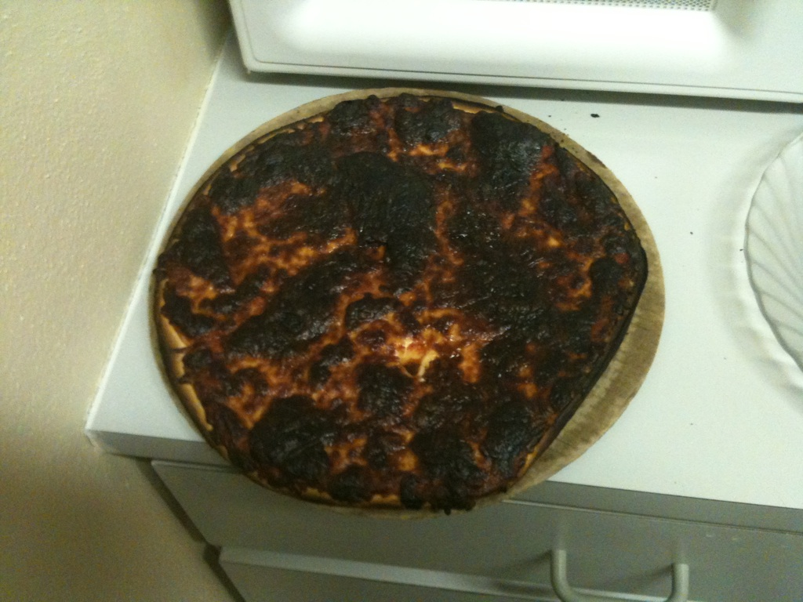

# OvenImp
This is a hardware application for the electric imp 001 module. OvenImp is a device designed to easily interface with your oven.

This is a device for those who can't remember to turn their oven or stove off. The imp will monitor the state of these elements and using the Twilio API it will send a text reminder to turn them off after a set period of time. 

Many low end ovens have horribly innacurate temperature control. The OvenImp provides an accurate temperature measurement using a thermocouple and will notify you when the oven is preheated. This will let you cook the perfect pizza everytime.

Pizza before OvenImp

Pizza after OvenImp

I wanted this project to be as close to a sellable product as possible. This is why I chose to build it on a PCB instead of a breadboard or perf board. I designed the board using Altium Designer and got it manufactured at AP Circuits in Alberta Canada due to their reasonable pricing and extremely fast turnaround time. The altium files are in a zip file in the repo for those interested.

Schematic

PCB layout

The Oven/stove on reminder works by detecting the ovens three built in lights which show when the oven or stove is on. The light is detected using three photoresistors each feeding in to a comparator circuit whose outputs are connected to the inputs of an OR gate. The output of this is connected to the Wakeup pin on the Imp 001. This is how the imp will wake up from deepsleep and know that the oven or stove is on. The imp will send a text notification after 30 minutes of it being on and every 10 minutes after that. (these values can be easily changed in the device code to whatever best suits your needs).

The OvenImp interfaces with three photoresistor probes and a thermocouple. You have to get creative in order to connect these to the OvenImps on board connectors.

In this application the photoresistors needed to extend out to the ovens lights. The photoresistors are a through hole component designed to be on a circuitboard. 
