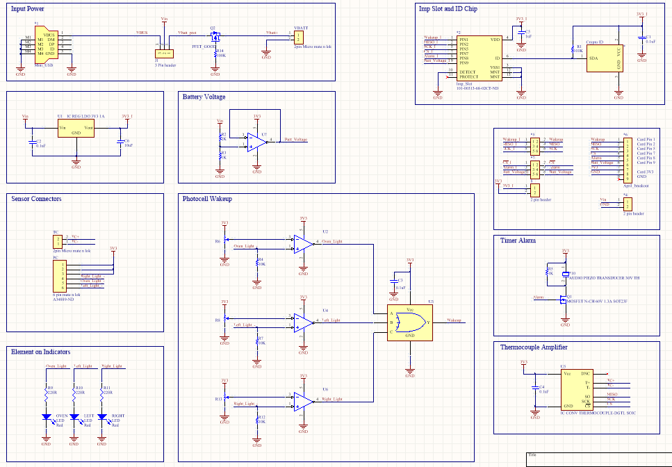

# OvenImp
This is a hardware application for the electric imp 001 module. OvenImp is a device designed to easily interface with your oven and provide mobile text notifications and data from it.

This is a device for those who can't remember to turn their oven or stove off. The imp will monitor the state of these elements and using the Twilio API it will send a text reminder to turn them off after a set period of time. 

Many low end ovens have horribly innacurate temperature control. The OvenImp provides an accurate temperature measurement using a thermocouple and will notify you when the oven is preheated. This will let you cook the perfect pizza everytime.

Pizza before OvenImp

Pizza after OvenImp

I wanted this project to be as close to a sellable product as possible. This is why I chose to build it on a PCB instead of a breadboard or perf board. I designed the board using Altium Designer and got it manufactured at AP Circuits in Alberta, Canada because of their reasonable pricing and extremely fast turnaround time. The altium files are in a zip file in the repo for those interested.

PCB

Schematic

PCB layout

The oven/stove on reminder works by detecting the ovens three built in lights which show when the oven or stove is on. This circuit enables the imp to go into deep sleep mode when it is not needed and automatically turn on when it is needed. The light is detected using three photoresistors each feeding in to a comparator circuit whose outputs are connected to the inputs of an OR gate. The output of this is connected to the Wakeup pin on the Imp 001. This is how the imp will wake up from deepsleep and know that the oven or stove is on. The imp will send a text notification after 30 minutes of it being on and every 10 minutes after that. (these values can be easily changed in the device code to whatever best suits your needs).

The photoresistors need to extend quite far from the imp. Because of this the photoresistors were spliced with wire and connected to the OvenImp connector.

The thermocouple interfaces with the MAX31855 IC which converts the analog voltage to a digital value and transmits it to the imp over SPI. In order to get oven temperatures from this simply place the probe in the oven while cooking and visit https://agent.electricimp.com/WKCeHKwjvcPJ to see the readings.

A custom 3D printed case was designed to house the OvenImp along with its 9V battery and be easily mounted with double sided tape to the side of the oven.

The software was written entirely using Electric Imp's web based IDE. The device code is all written in squirrel and the agent code is written using a combination of squirrel, HTML and some basic JavaScript. The agent code uses the Twilio API to enable the imp to send SMS notifications. It also uses the Rocky class to easily implement IO from the webpage and the agent.

The webpage for the OvenImp provides the temperature measurement in the oven and battery voltage so you know if the 9V battery should be changed. It also allows the user to input a preheat temperature. Once this temperature is reached the imp will send a SMS text and PWM the on board buzzer.

Web Page

This project utilizes a PCB for its components so it is relatively simple for someone to build it assuming they can solder SMD components. You will need to get a copy of the PCB by sending the provided Altium files to a PCB manufacturer. Once that is complete you will need to order the parts, a BOM can be created upon request for anyone interested. The only remaining assembly steps would be to splice the photoresistors on to wire of appropriate length and crimp the other end of the wire to connect to the on board connector. The same thing must be done for the 9V battery snap on connector and the thermocouple as the solid core wire used for it can not be crimped to the connector. If you have access to a 3D printer the .STL files for the enclosure have been provided. If you dont then you can easily mount the OvenImp to your oven using duct tape or something similar.

